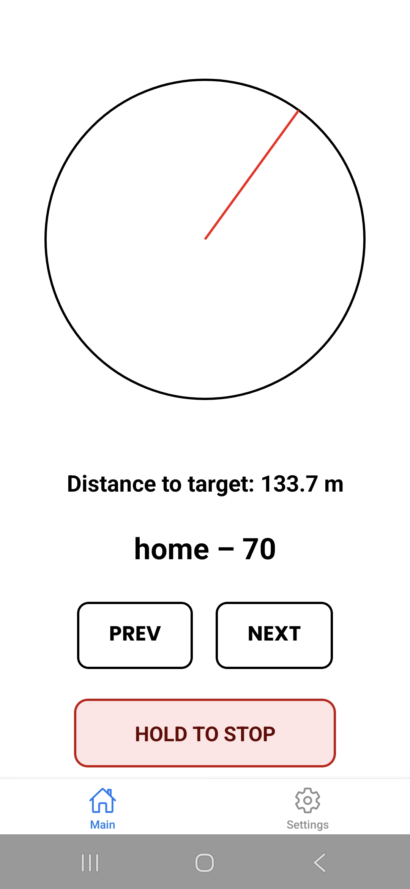
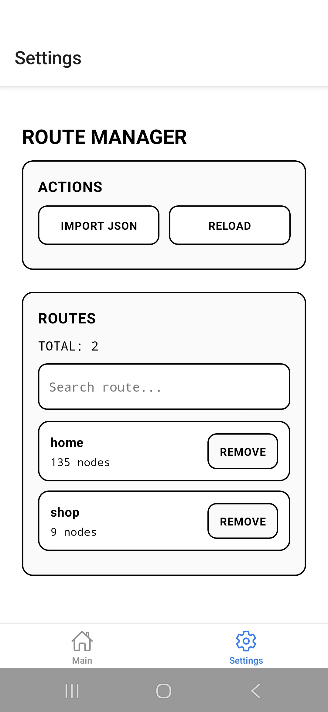
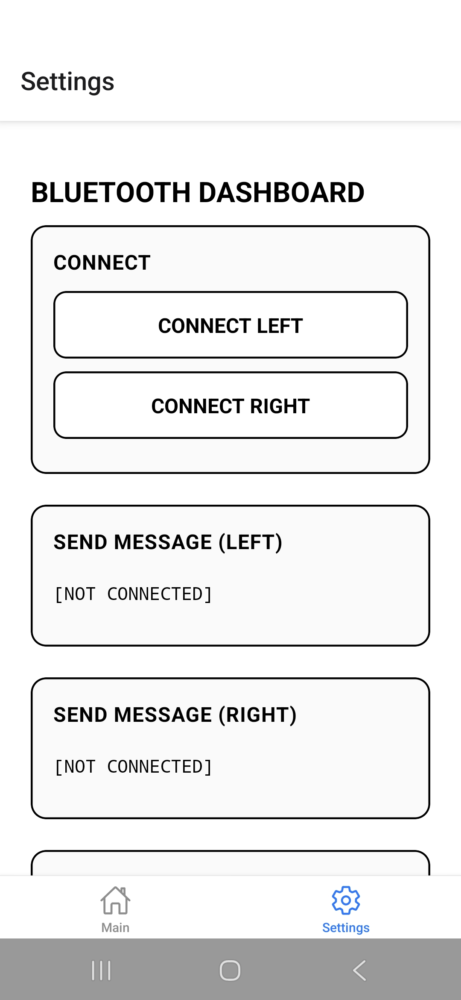

# AID App
*(AI + Dementia) App*

AID App is a guidance app built with React Native that connects over BLE to an ESP32-based bracelet(s) and guides the user along predefined routes using live GPS position and device heading.

## Features
- Live tracking using the device GPS position.
- Turn guidance using the device compass heading.
- Designed to work fully offline once routes are loaded.
- Lightweight UI focused on repeatable everyday routes.
- Support for multiple saved routes.
- Predefined routes built from JSON node graphs.
- BLE connection to two ESP32-based bracelets.
- Haptic cues delivered via the left/right ESP32-based bracelets, signalling when to turn left or right.
- Off-route alerts when the user strays too far from the path.
- Debug view with distance, accuracy, bearing, target status, and more.

## Build - Android (without Google Play)

Option A: EAS Build
```bash
npx eas build -p android --profile preview
```
Option B: Local Build with Gradle
```bash
npx expo prebuild --platform android
```
```bash
cd android
./gradlew clean
./gradlew assembleRelease
```

## Usage

1. Open the app.
2. Go to the **Settings** tab.
3. Open the **Route Manager**.
4. Tap **IMPORT JSON**.
5. Select a JSON route file.
6. (Optional) Repeat step 4-5 until you have imported all routes.
7. Go back to the **Settings** tab.
8. Open the **Bluetooth Dashboard**.
9. Power on both bracelets.
10. Tap **CONNECT LEFT** and **CONNECT RIGHT**.
11. Wait for both bracelets to connect.
12. (Optional) Test both bracelets by tapping **VIBRATE** in their respective sections.
13. Go back to the **Main** tab.
14. Tap any route from the list to select it and start guidance.

## Preview

<p float="left">
  
  
  
  
</p>

## Extras

Code for the ESP32-powered bracelet(s) and the route generation script is available in the `extras/` folder.

## Next steps

- Automate bracelet connection on app launch.
- Improve off-route detection logic and make reconnection to the route more reliable.
- Improve the Python route graph generation script.
- Add optional ESP32 bracelet screen and speaker support for status and guidance cues.

## Licence

This project is licensed under the MIT License.
Copyright © 2025 Nojus Balčiūnas